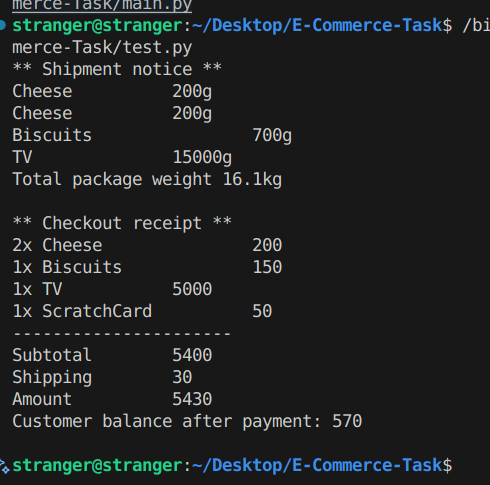

# E-Commerce Task

This is a simple Python-based e-commerce simulation. It demonstrates basic object-oriented programming concepts such as inheritance, composition, and factory patterns. The system supports products (including expirable and shippable items), a shopping cart, customer checkout, and shipping calculation.

## Features

- **Product Types:** Cheese, Biscuits, TV, Mobile Scratch Card
- **Expirable Products:** Cheese and Biscuits have expiry dates
- **Shippable Products:** Cheese, Biscuits, and TV can be shipped (with weight calculation)
- **Cart Management:** Add products to a cart with quantity checks
- **Checkout Process:** Handles stock, expiry, shipping, and customer balance
- **Shipping Service:** Calculates total package weight and prints shipment notice

## Project Structure

```
main.py      # Core classes and logic
test.py      # Example usage and test scenario
```

## Usage

1. **Clone or download this repository.**
2. **Run the test script:**
   ```bash
   python3 test.py
   ```
   This will:
   - Create several products
   - Add them to a cart
   - Simulate a customer checkout
   - Print a receipt and shipping notice


## Requirements

- Python 3.6 or higher

## Results
